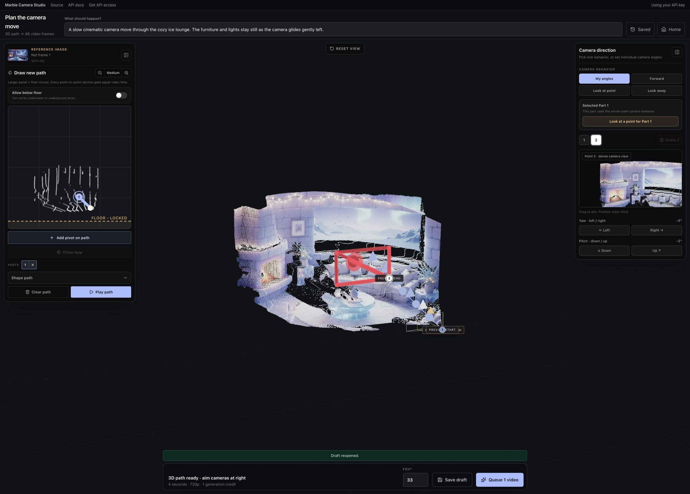
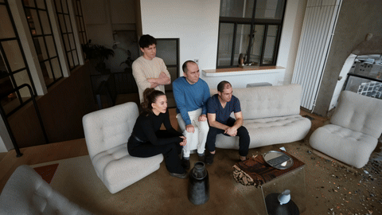

# Marble Camera Studio

[Try the hosted app](https://camera.wlt-ai.art) · [Join the API beta waitlist](https://form.typeform.com/to/zHFR4r3A) · [API quickstart](https://atlas-beta.worldlabs.ai/docs/quickstart)

Turn a still image into a camera-controlled shot with the Marble 5 API. Upload a photo, reconstruct its depth, choose a camera path, and generate a four-second MP4.

This repository contains the complete React editor, Express server, camera math, job runner, and optional hosted-demo billing. The local version uses your own API key. Hosted mode adds Clerk phone verification and one-time Stripe credit packs; there is no Metronome dependency.



## Example videos

Two camera-controlled videos shared by Jos. Click a preview to open the full MP4; the original files are included in [`examples/`](examples/).

### Original camera demo

[](examples/original-camera-demo.mp4)

The video from Jos's [“what did Ilya see?” post](https://x.com/JosvdWest/status/2094859846982275213). This earlier demo is supplied at 2560 × 1440, 30 FPS, four seconds. [Download MP4](https://github.com/worldlabsai/marble-camera-studio/raw/refs/heads/main/examples/original-camera-demo.mp4).

### Holographic fish orbit

[](examples/holographic-fish-orbit.mp4)

Prompt: **“camera orbits around holographic fish”**. Generated with Camera Studio: 1280 × 720, 48 frames at 12 FPS, seed 42. [Download MP4](https://github.com/worldlabsai/marble-camera-studio/raw/refs/heads/main/examples/holographic-fish-orbit.mp4).

The current app produces four-second videos at 12 FPS. These are output examples; the original source images and saved camera paths are not included.

## Run locally

You need Node.js 22.12+ (Node 24 recommended), FFmpeg on your PATH, and an API-enabled World Labs beta account.

1. Clone this repository and run `npm ci`.
2. Copy `.env.example` to `.env`.
3. Add your project API key as `WLT_API_KEY`.
4. Run `npm run build && npm start`.
5. Open [localhost:3030](http://localhost:3030), upload a JPG, PNG or WebP, to prepare its 3D scene.

The editor crops inputs to 16:9. Rotate the scene, draw a camera path on the map, adjust camera direction, and preview the move before choosing **Queue video**. Each video contains 48 frames at 12 FPS. MP4 encoding runs locally using FFmpeg.

Drag a camera or its numbered point in the 3D view to move it; drag empty space to rotate the scene. Use **Smooth path** to soften bends, and find **Look at point** below Yaw and Pitch. **Delete/Backspace** removes the selected camera. **Cmd/Ctrl-Z** undoes an edit; **Cmd/Ctrl-Shift-Z** redoes it. Each drag or drawn stroke is one undo step.

**Saved** contains drafts, generations, and favorites. Drafts are saved in this browser, separately for each signed-in account (up to 30 drafts), and need their source scene to remain available. Generated videos and scene data expire after seven days; download videos you want to keep.

For development, run `npm run dev` and `npx vite` in separate terminals. The Vite app proxies API requests to port 3030.

### Get an API key

Join the [World Labs beta waitlist](https://form.typeform.com/to/zHFR4r3A) if you don't already have access. Signing up requests access; it does not immediately issue a key.

After your account is enabled, open the [developer portal](https://atlas-beta.worldlabs.ai/developers), select a project, and create an API key with task creation, operation reading, and asset creation/reading permissions. Keep the key in the server's `.env`; never paste it into frontend source or commit it.

The API is currently served from `https://api.atlas-beta.worldlabs.ai/api/v2`. See the [API quickstart](https://atlas-beta.worldlabs.ai/docs/quickstart) for current access and setup details. API charges are billed to the project that owns your key.

## How it works

1. The browser resizes the image to 1280 × 720.
2. The server calls `tasks:images2PosedRGBD` and polls the returned operation.
3. The editor decodes the EXR depth map and reconstructs a colored point cloud.
4. The editor smooths the drawn path and interpolates camera positions and directions into 48 target cameras.
5. The server calls `tasks:atlasGenerate`, downloads the frames, and encodes an MP4.

The preview is a point cloud used to plan the camera. Generated views can reveal details that are absent from the original image.

## Host a demo

See [hosted setup](docs/hosting.md). Hosted mode requires verified phone ownership before preparing images or generating. Each phone can claim three free generations once, even across accounts. One-time credit packs offer 3 generations for $5, 12 for $20, or 60 for $100 through Stripe Checkout.

Credits are reserved before generation and returned on terminal failure. Duplicate webhooks and repeated job requests do not double-credit or double-charge. Interrupted workers resume stored operation IDs. Job inputs and videos are kept for seven days; download finished shots before they expire.

Local mode has no authentication or paywall and binds to loopback only. Use hosted mode for any shared deployment.

## Verify changes

```sh
npm run typecheck
npm test
npm run build
```

Tests exercise the original trajectory drawing and camera math, coordinate transforms, ledger concurrency, payment validation, refunds, and job recovery. They do not replace a real Stripe Checkout, SMS verification, and Marble API smoke test before deployment.

## License and credits

MIT. The editor, drawing controls, and trajectory math are adapted from Gowthami's camera-trajectory app at World Labs. Built with Three.js, React Three Fiber, Clerk, Stripe, and FFmpeg. World Labs API usage is subject to the service's own terms and charges.
